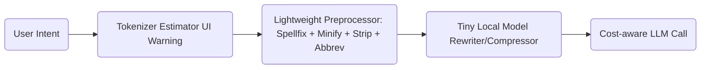

Here’s a fairly exhaustive playbook of strategies and architectural patterns teams use when trying to **minimize total token usage across many agents/users**, without materially degrading performance — especially when computation has to stay mostly local.

---

## 🔌 1. *Client-side Pre-processing & Compression Pipelines*

Before a prompt ever reaches the paid LLM endpoint, run lightweight processing to shrink or sanitize inputs:

| Technique                                             | Description                                                                                                         | Implementation options                                              |
| ----------------------------------------------------- | ------------------------------------------------------------------------------------------------------------------- | ------------------------------------------------------------------- |
| **Spell-fix + synonym normalization**                 | Convert typos & rare spellings into common ones (tokenizers compress common words far better).                      | Local spaCy / SymSpell / word-embedding nearest-neighbor lookup     |
| **Automatic prompt compression**                      | Rewrite verbose user prompts into a shorter canonical form: e.g. “Please write me code that…” → “Generate code:”    | Train a tiny custom distilled model or rule-based rewrite templates |
| **Abbreviation engine**                               | Replace multi-token phrases with agreed shorthand on the fly: “pull request” → “PR”; “error message” → “errmsg”. | Shared dictionary & reversible mapping                              |
| **Extraneous text stripper**                          | Delete headers/footers, repeated greetings, signatures, emoji, legal disclaimers, etc.                              | Regex pipeline or lightweight ML classifier                         |
| **Deduplication / summarization of previous context** | Only keep a *summary* of earlier conversation history rather than full raw text.                                    | Local embedding semantic dedupe + compression                       |
| **Minify structured data**                            | Remove whitespace/newlines in JSON/HTML/code snippets if formatting doesn’t matter.                                 | JSON.stringify / HTML minifiers                                     |

---

## 🧠 2. *Mini-LLM / Distilled Rewriters as Preprocessors*

Locally run a **very small distilled model** (e.g. 7B → 3B → 500M) *just to compress text*. Think:

* Rewrite informal or messy developer messages into dense tokens ("please can you…" → "Do:")
* Summarize large context chunks *before* passing to the expensive agent.

This is realistically doable with:

* `distilBERT`, `TinyLLaMA`, `Phi`, or even 100M-200M custom LoRA-tuned models.
* Run inference in under \~50ms on CPUs.

Goal isn’t intelligence — just **token optimization + normalization**.

---

## 🔁 3. *Prompt-Template Refactoring*

Across thousands of calls, **tiny inefficiencies in prompt templates explode cost**.

Strategies:

* Reuse system prompts via IDs instead of embedding full text every call (agent sees a numeric ID → expands internally).
* Strip filler like "As an AI assistant…" unless absolutely needed by policy.
* Store task instructions in a compressed lookup, not sent every time.
* Parameterize prompts so only critical variables change.

---

## 📓 4. *Context Management Strategies*

Keep total context window minimal without losing performance:

| Strategy           | Trade-off                                                                  |
| ------------------ | -------------------------------------------------------------------------- |
| Sliding window     | Drop oldest history                                                        |
| Summarized history | Keep TL;DRs of past                                                        |
| Reference tagging  | Use `#ref123` instead of re-sending full text                              |
| External memory    | Cache context locally and refer to it (“see doc A”) rather than embedding. |

---

## 🤝 5. *Collaboration-wide Standardization*

Set up org-level **token discipline policies** and tooling:

* Use shared glossaries and shorthand ("issue → iss", "environment → env").
* Build a tokenizer visualizer into the IDE so engineers *see* how many tokens they’re generating as they type.
* Linting/CI bots that flag verbose prompts in code (“this system prompt is 600 tokens – recommended <=200”).

---

## 📉 6. *ROI-based Call Skipping / Throttling*

Avoid unnecessary LLM calls altogether:

* Detect trivial or repetitive requests → short-circuit locally.
* Update regression test suggestions only after N code lines changed.
* Only re-ask agents after on-device heuristic fails.
* Batch multiple requests into one call where the LLM can handle them in one go.

---

## 📦 7. *Compression-based Approaches for Pass-through Text*

If lots of text must be passed (logs, traces, configs), use:

* Domain-specific lossy compressors (hash stack traces into Bloom filters, canonicalize JSON).
* Summarize logs locally using small models.
* Extract only salient lines rather than full file.

---

## 🔧 What would the pipeline actually *look like*?

Example deployable local stack per engineer:

---

## ⛏️ Want help building this?

I can:

* Prototype a *prompt-rewriter/compressor* small model architecture.
* Suggest off-the-shelf libraries you can chain locally.
* Draft an RFC for your engineers on “Token Budget Best Practices”.

Would you like example implementations, tiny model suggestions, or sample compression code?

