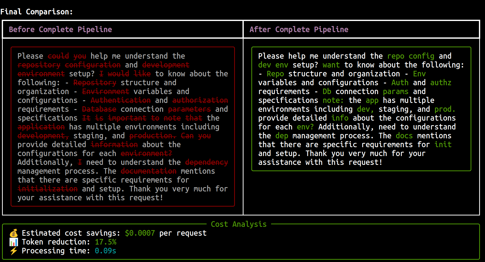

# Token Optimizer Pipeline

A modular pipeline for reducing LLM token usage while preserving semantic meaning.



## Features

- **Spell Checking**: Fixes typos that waste tokens
- **Abbreviations**: Replaces common long forms with standard abbreviations
- **Token-Aware Optimization**: Only makes replacements that actually save tokens
- **ML Paraphrasing**: Uses small models (T5-small) to compress text intelligently
- **Modular Design**: Enable/disable stages as needed
- **Token Counting**: Accurate token measurement for your target LLM
- **Verbose Mode**: Beautiful terminal UI with diffs, stats, and visualizations

## Quick Start

1. **Setup Environment**

```bash
chmod +x setup.sh
./setup.sh
source venv/bin/activate
```

2. **Basic Usage**

```bash
# Process a file
python pipeline.py input.txt -o output.txt

# Process from stdin
echo "Please could you help me with this repository configuration?" | python pipeline.py

# Analyze optimization potential
python pipeline.py input.txt --analyze

# 🎨 NEW: Verbose mode with beautiful diffs
python pipeline.py input.txt --verbose
```

3. **Run Individual Stages**

```bash
# Just spell check
python scripts/01_spell_check.py input.txt

# Just abbreviations
python scripts/02_abbreviations.py input.txt

# Just token-aware optimization
python scripts/03_token_aware.py input.txt -m gpt2

# Just ML paraphrasing
python scripts/04_ml_paraphrase.py input.txt -r 0.7
```

## Configuration

Edit `config/pipeline_config.yaml` to:

- Change target tokenizer (gpt2, gpt-3.5-turbo, claude, etc.)
- Enable/disable pipeline stages
- Adjust compression aggressiveness
- Set custom abbreviations path

## Pipeline Stages

### 1. Spell Check (`01_spell_check.py`)

- Fixes common typos using SymSpell
- Preserves code blocks and URLs
- Maintains original case

### 2. Abbreviations (`02_abbreviations.py`)

- Replaces verbose phrases with standard abbreviations
- Customizable via `config/abbreviations.json`
- Context-aware replacements

### 3. Token-Aware (`03_token_aware.py`)

- Counts actual tokens before/after replacement
- Only applies changes that save tokens
- Model-specific optimization

### 4. ML Paraphrase (`04_ml_paraphrase.py`)

- Uses T5-small for intelligent compression
- Can use LLMLingua if installed
- Maintains semantic meaning

## Examples

### Example 1: Basic Compression

```bash
$ echo "I would like to understand the repository configuration please" | python pipeline.py

want understand repo config
```

### Example 2: Technical Text

```bash
$ echo "The development environment requires authentication and authorization" | python pipeline.py

dev env requires auth authz
```

### Example 3: Analysis Mode

```bash
$ python pipeline.py document.txt --analyze

Potential token-aware optimizations:
  'it is' → 'it's': 5x, save 5 tokens
  'do not' → 'don't': 3x, save 3 tokens
  'repository' → 'repo': 2x, save 4 tokens
```

## Customization

### Add Custom Abbreviations

Edit `config/abbreviations.json`:

```json
{
  "technical_terms": {
    "your_long_term": "ylt",
    "another_phrase": "ap"
  }
}
```

### Change Target Model

Edit `config/pipeline_config.yaml`:

```yaml
tokenizer:
  model: "gpt-3.5-turbo" # or "claude", "llama2", etc.
```

### Adjust Compression Level

```yaml
ml_paraphrase:
  max_length_ratio: 0.6 # More aggressive (60% of original)
```

## Performance

Typical results:

- Rule-based stages: <50ms
- ML paraphrasing: 200-500ms (CPU), 50-100ms (GPU)
- Overall reduction: 30-60% fewer tokens

## Verbose Mode

The `--verbose` flag enables a beautiful terminal UI that shows:

### Visual Diffs

- Side-by-side before/after comparison
- Color-coded changes (red=removed, green=added)
- Word-level highlighting

### Detailed Statistics

- Token counts at each stage
- Processing time per stage
- Replacement frequency tables
- Cost savings estimation

### Progress Visualization

- Token reduction progress bars
- Stage-by-stage transformation
- Final summary with charts

### Example:

```bash
# See the magic happen
python pipeline.py test_example.txt --verbose

# Run the verbose demo
./demo_verbose.sh
```

## Tips

1. **For code/technical content**: Disable ML paraphrasing
2. **For natural language**: Enable all stages
3. **For real-time**: Use only stages 1-3
4. **For batch processing**: Enable all stages with aggressive settings
5. **For debugging**: Use `--verbose` to see exactly what changes

## Troubleshooting

- **Import errors**: Run `./setup.sh` again
- **Slow performance**: Disable ML paraphrasing or use GPU
- **Over-compression**: Increase `max_length_ratio` in config
- **Under-compression**: Add more abbreviations, decrease `min_token_savings`
- **Verbose mode not working**: Install rich with `pip install rich`
